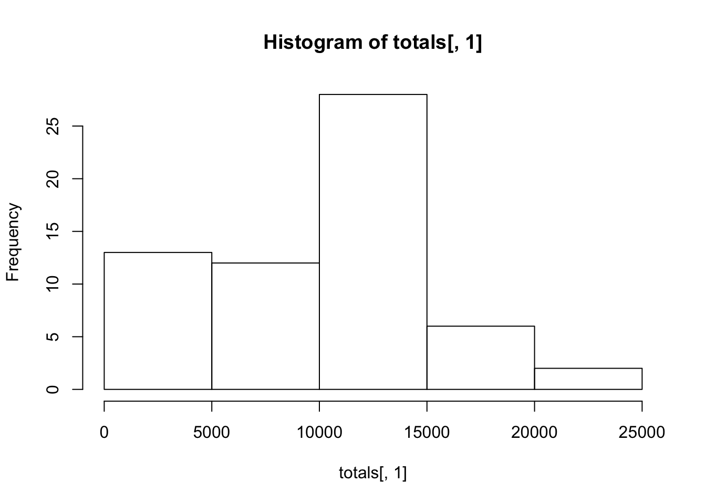
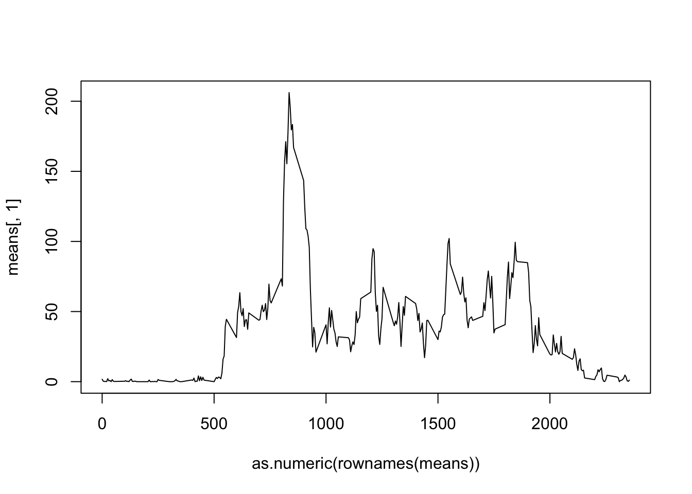
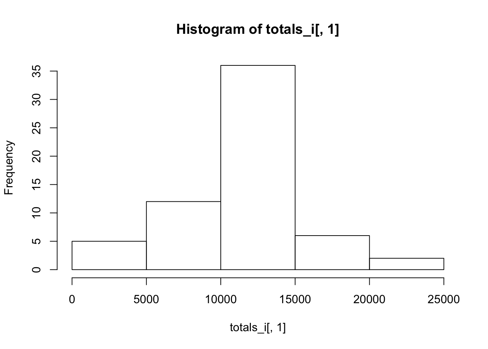
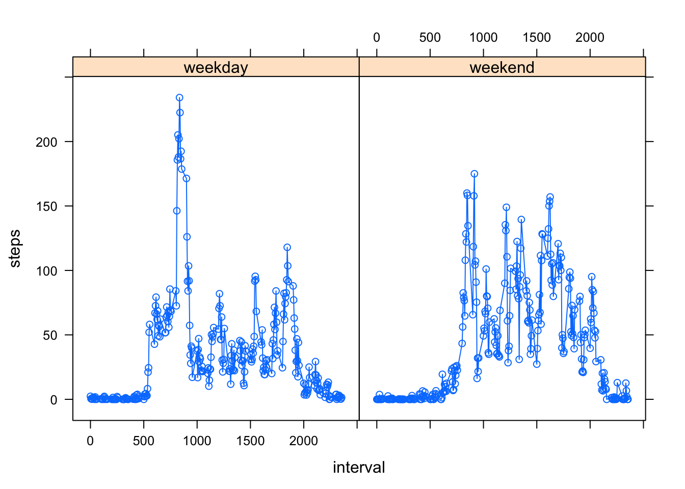

This R markdown document shows how to read in activity monitoring data and answers a series of questions by analyzing it.

The first chunk of code reads in the data and processes it for analysis.


```r
library(lattice)
library(reshape2)

file <- "https://d396qusza40orc.cloudfront.net/repdata%2Fdata%2Factivity.zip"
download.file(file, "temp.zip")
unzip("temp.zip")
data <- read.csv("activity.csv")
totals <- as.data.frame(with(data, tapply(steps, date, sum, na.rm = TRUE)))
```


###1. What is mean total number of steps taken per day?


```r
hist(totals[,1])
```



```r
mean(totals[,1])
```

```
## [1] 9354.23
```

```r
median(totals[,1])
```

```
## [1] 10395
```


###2. What is the average daily activity pattern?


```r
means <- as.data.frame(with(data, tapply(steps, interval, mean, na.rm = TRUE)))
plot(as.numeric(rownames(means)), means[,1], type="l")
```



```r
rownames(means)[means[,1] == max(means[,1])]
```

```
## [1] "835"
```


###3. Imputing missing values


```r
means$interval <- rownames(means)
colnames(means) <- c("mean","interval") 
countnas <- is.na(data$steps)
sum(countnas)
```

```
## [1] 2304
```

```r
data_imputed <- data
data_imputed <- merge(data_imputed, means, by = "interval", all.x = TRUE)
data_imputed$steps[is.na(data_imputed$steps) == TRUE] <- data_imputed$mean[is.na(data_imputed$steps) == TRUE]
totals_i <- as.data.frame(with(data_imputed, tapply(steps, date, sum, na.rm = TRUE)))
hist(totals_i[,1])
```



```r
mean(totals_i[,1])
```

```
## [1] 10766.19
```

```r
median(totals_i[,1])
```

```
## [1] 10766.19
```

```r
compare <- as.data.frame(matrix(c(mean(totals[,1]),mean(totals_i[,1]), median(totals[,1]), median(totals_i[,1])), nrow = 2, ncol = 2))
rownames(compare) <- c("Original", "Imputed")
colnames(compare) <- c("Mean", "Median")
compare
```

```
##              Mean   Median
## Original  9354.23 10395.00
## Imputed  10766.19 10766.19
```


###4. Are there differences in activity patterns between weekdays and weekends?


```r
data$weekend <- (weekdays(as.Date(as.character(data$date)), abbreviate = TRUE) == "Sat" | weekdays(as.Date(as.character(data$date)), abbreviate = TRUE) == "Sun")
data$weekend <- factor(data$weekend, labels = c("weekday", "weekend"))
wmeans <- aggregate(steps~interval+weekend, data=data, mean, na.rm = TRUE)
xyplot(steps ~ interval | weekend, data = wmeans, type = "b")
```




